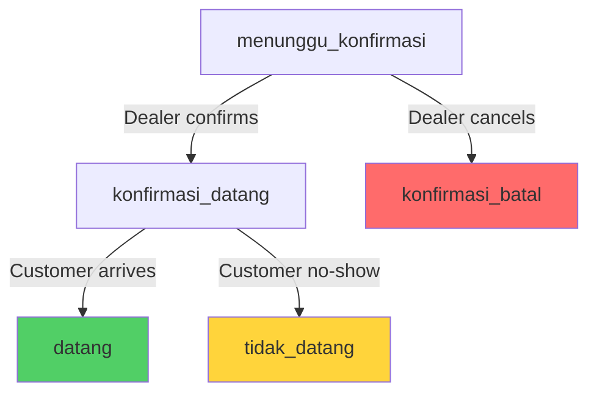

# 🚀 Development Plan

> **Vehicle Service Reservation API**  
> Phased Development Roadmap

---

## 📋 Overview

This document outlines the complete development plan for the Vehicle Service Reservation API, broken down into 8 phases. Each phase builds upon the previous one, ensuring a solid foundation and incremental delivery of features.

---

## ✅ PHASE 0 — PROJECT FOUNDATION

### 🎯 Goal
- Repo siap dikembangkan
- Tooling & struktur dasar rapi
- Developer experience optimal

### 📦 Deliverables
- [x] Node.js + Express (ESM)
- [x] Project structure clean & modular
- [x] `.env` / `.env.example`
- [x] npm scripts (`dev`, `start`, `lint`)
- [x] ESLint + Prettier configuration
- [x] `.gitignore` properly configured

### 📁 File Structure
```
vehicle-service-reservation-api/
├── src/
│   ├── modules/
│   ├── middlewares/
│   ├── utils/
│   └── index.js
├── .env.example
├── .gitignore
├── package.json
└── README.md
```

### 🔑 Key Decisions
- **ESM** (import/export) instead of CommonJS
- **Modular monolith** architecture
- **Express.js** as web framework

### ✅ Status
**DONE** ✅  
👉 Tidak disentuh lagi kecuali bug

---

## ✅ PHASE 1 — INFRA & DATABASE

### 🎯 Goal
- Environment konsisten across machines
- Tidak tergantung mesin lokal
- Zero DB privilege issue
- Production-ready infrastructure

### 📦 Deliverables
- [x] **Dockerfile** (Node.js 20 Alpine)
- [x] **docker-compose.yml** (API + MySQL)
- [x] **MySQL 8** database
- [x] **Prisma ORM** setup
- [x] Database schema (`schema.prisma`)
- [x] Migration scripts
- [x] Seed scripts (sample data)
- [x] Healthcheck (DB + API)
- [x] Restart policy (`unless-stopped`)

### 🗄️ Database Schema
```prisma
model Dealer {
  id        String   @id @default(uuid())
  name      String
  username  String   @unique
  password  String   // bcrypt hashed
  address   String
  createdAt DateTime @default(now())
}

model ServiceSchedule {
  id             String   @id @default(uuid())
  serviceDate    DateTime
  serviceTime    DateTime
  quota          Int
  remainingQuota Int
  createdAt      DateTime @default(now())
  updatedAt      DateTime @updatedAt
  bookings       ServiceBooking[]
}

model ServiceBooking {
  id                String          @id @default(uuid())
  serviceScheduleId String
  customerName      String
  phoneNo           String
  vehicleType       String
  licensePlate      String
  vehicleProblem    String
  status            BookingStatus   @default(menunggu_konfirmasi)
  createdAt         DateTime        @default(now())
  updatedAt         DateTime        @updatedAt
  serviceSchedule   ServiceSchedule @relation(...)
}

enum BookingStatus {
  menunggu_konfirmasi
  konfirmasi_batal
  konfirmasi_datang
  tidak_datang
  datang
}
```

### 🐳 Docker Configuration
```yaml
# docker-compose.yml
services:
  db:
    image: mysql:8
    environment:
      MYSQL_ROOT_PASSWORD: root
      MYSQL_DATABASE: vehicle_service
    healthcheck:
      test: ["CMD", "mysqladmin", "ping", "-h", "localhost"]
      interval: 10s
      timeout: 5s
      retries: 5

  api:
    build: .
    ports:
      - "3000:3000"
    environment:
      DATABASE_URL: mysql://root:root@db:3306/vehicle_service
    depends_on:
      db:
        condition: service_healthy
```

### 🔑 Key Decisions
- **DB_HOST=db** (Docker service name)
- **MySQL via Docker** (no local installation needed)
- **Prisma** for type-safe database access
- **Healthcheck + depends_on condition** (API waits for DB)
- **Volume persistence** for database data

### ✅ Status
**DONE** ✅  
🔥 **Ini nilai besar di mata reviewer** — Shows DevOps competency

---

## ✅ PHASE 2 — AUTH DEALER

### 🎯 Goal
- Dealer bisa login
- API aman & terproteksi
- Token-based authentication

### 📦 Deliverables
- [x] **Dealer login endpoint** (`POST /auth/login`)
- [x] **bcrypt** password verification
- [x] **JWT** access token generation
- [x] **Auth middleware** (`authMiddleware.js`)
- [x] **Role middleware** (`dealerOnly.js`)
- [x] Protected routes (dealer only)

### 🔐 Security Implementation
```javascript
// Password hashing (during seed/registration)
const hashedPassword = await bcrypt.hash(password, 10);

// Login flow
1. Validate credentials (username + password)
2. Verify password: bcrypt.compare(password, hashedPassword)
3. Generate JWT: jwt.sign({ id, username, role: 'dealer' }, SECRET, { expiresIn: '24h' })
4. Return token to client

// Protected route
router.post('/dealer/schedules', authMiddleware, dealerOnly, scheduleController.create);
```

### 📁 Module Structure
```
src/modules/auth/
├── auth.controller.js   # POST /auth/login
├── auth.service.js      # JWT generation, password verification
├── auth.repo.js         # Query dealer from DB
└── auth.schema.js       # Validation (username, password)
```

### 🔑 Key Decisions
- **Password hashed** with bcrypt (salt rounds: 10)
- **Token-based auth** (stateless)
- **JWT expiry**: 24 hours
- **No refresh token** (simplified for MVP)

### ✅ Status
**DONE** ✅  
🔥 **Ini core backend competency** — Authentication is fundamental

---

## ⏭️ PHASE 3 — SERVICE SCHEDULE MANAGEMENT

### 🎯 Goal
- Dealer dapat mengatur jadwal servis
- CRUD operations untuk schedule
- Validation & business rules

### 📦 Deliverables

#### **Endpoints**
| Method | Endpoint | Description | Auth |
|--------|----------|-------------|------|
| POST | `/dealer/schedules` | Create new schedule | ✅ Dealer |
| GET | `/dealer/schedules` | List all schedules | ✅ Dealer |
| GET | `/dealer/schedules/:id` | Get schedule detail | ✅ Dealer |
| PUT | `/dealer/schedules/:id` | Update schedule | ✅ Dealer |
| DELETE | `/dealer/schedules/:id` | Delete schedule | ✅ Dealer |
| GET | `/schedules/available` | Get available schedules (quota > 0) | ❌ Public |

#### **Request/Response Examples**

**Create Schedule**
```http
POST /dealer/schedules
Authorization: Bearer <jwt_token>
Content-Type: application/json

{
  "serviceDate": "2026-01-23",
  "serviceTime": "09:00:00",
  "quota": 10
}

Response (201):
{
  "success": true,
  "data": {
    "id": "uuid",
    "serviceDate": "2026-01-23",
    "serviceTime": "09:00:00",
    "quota": 10,
    "remainingQuota": 10,
    "createdAt": "2026-01-21T14:25:39+07:00"
  }
}
```

**Get Available Schedules** (Public)
```http
GET /schedules/available?date=2026-01-23

Response (200):
{
  "success": true,
  "data": [
    {
      "id": "uuid",
      "serviceDate": "2026-01-23",
      "serviceTime": "09:00:00",
      "remainingQuota": 7
    },
    {
      "id": "uuid",
      "serviceDate": "2026-01-23",
      "serviceTime": "14:00:00",
      "remainingQuota": 10
    }
  ]
}
```

### 📋 Business Rules
- ✅ Dealer only (JWT protected)
- ✅ `serviceDate` tidak boleh tanggal lampau
- ✅ `quota` harus > 0
- ✅ `remainingQuota` diinisialisasi sama dengan `quota`
- ✅ Kombinasi `serviceDate` + `serviceTime` harus unik
- ✅ Soft delete (opsional, nilai plus)

### 📁 Module Structure
```
src/modules/serviceSchedule/
├── serviceSchedule.controller.js
├── serviceSchedule.service.js
├── serviceSchedule.repo.js
└── serviceSchedule.schema.js
```

### 🔑 Key Implementation Points

**Validation Schema**
```javascript
// serviceSchedule.schema.js
export const createScheduleSchema = z.object({
  serviceDate: z.string().refine(date => new Date(date) > new Date(), {
    message: "Service date must be in the future"
  }),
  serviceTime: z.string().regex(/^([0-1][0-9]|2[0-3]):[0-5][0-9]:[0-5][0-9]$/),
  quota: z.number().int().positive()
});
```

**Service Layer**
```javascript
// serviceSchedule.service.js
export const create = async (data) => {
  // Validate date not in past
  if (new Date(data.serviceDate) <= new Date()) {
    throw new BusinessError("Service date must be in the future");
  }

  // Check uniqueness
  const existing = await scheduleRepo.findByDateTime(data.serviceDate, data.serviceTime);
  if (existing) {
    throw new BusinessError("Schedule already exists for this date and time");
  }

  // Create with remainingQuota = quota
  return await scheduleRepo.create({
    ...data,
    remainingQuota: data.quota
  });
};
```

### 🧪 Testing Checklist
- [ ] Create schedule with valid data
- [ ] Reject schedule with past date
- [ ] Reject duplicate schedule (same date + time)
- [ ] Update schedule quota
- [ ] Delete schedule (soft delete)
- [ ] List schedules with pagination
- [ ] Get available schedules (remainingQuota > 0)

### ⏱️ Estimated Time
**2-3 days**

### ✅ Status
**⏳ TODO** — Next priority

---

## ⏭️ PHASE 4 — CUSTOMER SERVICE BOOKING

### 🎯 Goal
- Customer dapat melakukan pemesanan servis
- Quota management otomatis
- H+1 validation

### 📦 Deliverables

#### **Endpoints**
| Method | Endpoint | Description | Auth |
|--------|----------|-------------|------|
| POST | `/bookings` | Create booking | ❌ Public |
| GET | `/schedules/available` | Get available schedules | ❌ Public |

#### **Request/Response Examples**

**Create Booking**
```http
POST /bookings
Content-Type: application/json

{
  "serviceScheduleId": "uuid",
  "customerName": "John Doe",
  "phoneNo": "081234567890",
  "vehicleType": "Toyota Avanza",
  "licensePlate": "B 1234 XYZ",
  "vehicleProblem": "Ganti oli dan servis rutin"
}

Response (201):
{
  "success": true,
  "data": {
    "id": "uuid",
    "customerName": "John Doe",
    "phoneNo": "081234567890",
    "vehicleType": "Toyota Avanza",
    "licensePlate": "B 1234 XYZ",
    "vehicleProblem": "Ganti oli dan servis rutin",
    "status": "menunggu_konfirmasi",
    "serviceSchedule": {
      "serviceDate": "2026-01-23",
      "serviceTime": "09:00:00"
    },
    "createdAt": "2026-01-21T14:25:39+07:00"
  },
  "message": "Booking berhasil! Silakan tunggu konfirmasi dari dealer."
}
```

### 📋 Business Rules
1. ✅ **H+1 minimum**: `serviceDate` harus minimal besok
2. ✅ **Jam servis wajib dipilih**: `serviceScheduleId` required
3. ✅ **Kuota harus tersedia**: `remainingQuota > 0`
4. ✅ **Kuota berkurang otomatis**: Decrease `remainingQuota` by 1
5. ✅ **Default status**: `menunggu_konfirmasi`
6. ✅ **Atomic operation**: Transaction untuk quota + booking

### 🔥 Critical Implementation Points

#### **1. H+1 Validation**
```javascript
// shared/utils/dateValidator.js
export const isValidBookingDate = (serviceDate) => {
  const today = new Date();
  today.setHours(0, 0, 0, 0);
  
  const tomorrow = new Date(today);
  tomorrow.setDate(tomorrow.getDate() + 1);
  
  const selectedDate = new Date(serviceDate);
  selectedDate.setHours(0, 0, 0, 0);
  
  return selectedDate >= tomorrow;
};
```

#### **2. Race Condition Handling**
```javascript
// serviceBooking.service.js
export const create = async (data) => {
  return await prisma.$transaction(async (tx) => {
    // 1. Lock schedule row (SELECT FOR UPDATE)
    const schedule = await tx.serviceSchedule.findUnique({
      where: { id: data.serviceScheduleId },
    });

    // 2. Validate H+1
    if (!isValidBookingDate(schedule.serviceDate)) {
      throw new BusinessError("Booking must be at least H+1");
    }

    // 3. Check quota
    if (schedule.remainingQuota < 1) {
      throw new BusinessError("No quota available");
    }

    // 4. Decrease quota
    await tx.serviceSchedule.update({
      where: { id: data.serviceScheduleId },
      data: { remainingQuota: { decrement: 1 } },
    });

    // 5. Create booking
    return await tx.serviceBooking.create({
      data: {
        ...data,
        status: 'menunggu_konfirmasi',
      },
      include: {
        serviceSchedule: {
          select: {
            serviceDate: true,
            serviceTime: true,
          },
        },
      },
    });
  });
};
```

#### **3. Transaction Isolation**
```javascript
// Use READ COMMITTED isolation level
await prisma.$transaction(
  async (tx) => { /* ... */ },
  {
    isolationLevel: 'ReadCommitted',
    maxWait: 5000,
    timeout: 10000,
  }
);
```

### 📁 Module Structure
```
src/modules/serviceBooking/
├── serviceBooking.controller.js
├── serviceBooking.service.js
├── serviceBooking.repo.js
└── serviceBooking.schema.js

src/modules/shared/
└── utils/
    └── dateValidator.js
```

### 🧪 Testing Checklist
- [ ] Create booking with valid data
- [ ] Reject booking for today (not H+1)
- [ ] Reject booking when quota = 0
- [ ] Verify quota decreases after booking
- [ ] Test concurrent bookings (race condition)
- [ ] Validate all required fields
- [ ] Test phone number format
- [ ] Test license plate format

### 🔥 Reviewer Focus Areas
- **Transaction handling**: Atomic quota + booking
- **Race condition**: Concurrent booking prevention
- **Validation**: H+1 rule, quota check
- **Error messages**: Clear & user-friendly

### ⏱️ Estimated Time
**3-4 days**

### ✅ Status
**⏳ TODO** — High priority

---

## ⏭️ PHASE 5 — BOOKING STATUS MANAGEMENT

### 🎯 Goal
- Dealer dapat mengelola status pemesanan
- Quota restoration untuk pembatalan
- Status transition rules

### 📦 Deliverables

#### **Endpoints**
| Method | Endpoint | Description | Auth |
|--------|----------|-------------|------|
| GET | `/dealer/bookings` | List all bookings | ✅ Dealer |
| GET | `/dealer/bookings/:id` | Get booking detail | ✅ Dealer |
| PATCH | `/dealer/bookings/:id/status` | Update booking status | ✅ Dealer |

#### **Request/Response Examples**

**List Bookings**
```http
GET /dealer/bookings?status=menunggu_konfirmasi&date=2026-01-23
Authorization: Bearer <jwt_token>

Response (200):
{
  "success": true,
  "data": [
    {
      "id": "uuid",
      "customerName": "John Doe",
      "phoneNo": "081234567890",
      "vehicleType": "Toyota Avanza",
      "licensePlate": "B 1234 XYZ",
      "status": "menunggu_konfirmasi",
      "serviceSchedule": {
        "serviceDate": "2026-01-23",
        "serviceTime": "09:00:00"
      },
      "createdAt": "2026-01-21T14:25:39+07:00"
    }
  ],
  "meta": {
    "total": 15,
    "page": 1,
    "limit": 10
  }
}
```

**Update Status**
```http
PATCH /dealer/bookings/:id/status
Authorization: Bearer <jwt_token>
Content-Type: application/json

{
  "status": "konfirmasi_batal",
  "reason": "Customer tidak bisa hadir" // optional
}

Response (200):
{
  "success": true,
  "data": {
    "id": "uuid",
    "status": "konfirmasi_batal",
    "updatedAt": "2026-01-21T14:30:00+07:00"
  },
  "message": "Status updated. Quota restored."
}
```

### 📋 Status Flow



### 📋 Business Rules

#### **Status Transitions**
| From | To | Quota Action | Notes |
|------|-----|--------------|-------|
| `menunggu_konfirmasi` | `konfirmasi_datang` | No change | Dealer confirms |
| `menunggu_konfirmasi` | `konfirmasi_batal` | **+1 quota** | Dealer cancels |
| `konfirmasi_datang` | `datang` | No change | Customer arrives |
| `konfirmasi_datang` | `tidak_datang` | No change | Customer no-show |

#### **Validation Rules**
- ✅ Only dealer can update status
- ✅ Cannot change status if already `datang` or `tidak_datang` (final states)
- ✅ Status must be valid enum value
- ✅ Quota restoration only for `konfirmasi_batal`

### 🔑 Key Implementation

**Service Layer**
```javascript
// serviceBooking.service.js
export const updateStatus = async (bookingId, newStatus) => {
  return await prisma.$transaction(async (tx) => {
    // 1. Get current booking
    const booking = await tx.serviceBooking.findUnique({
      where: { id: bookingId },
      include: { serviceSchedule: true },
    });

    if (!booking) {
      throw new NotFoundError("Booking not found");
    }

    // 2. Validate status transition
    if (['datang', 'tidak_datang'].includes(booking.status)) {
      throw new BusinessError("Cannot change status of completed booking");
    }

    // 3. Restore quota if cancelling
    if (newStatus === 'konfirmasi_batal' && booking.status === 'menunggu_konfirmasi') {
      await tx.serviceSchedule.update({
        where: { id: booking.serviceScheduleId },
        data: { remainingQuota: { increment: 1 } },
      });
    }

    // 4. Update booking status
    return await tx.serviceBooking.update({
      where: { id: bookingId },
      data: { status: newStatus },
    });
  });
};
```

**Status History (Optional, Nilai Plus)**
```prisma
model BookingStatusHistory {
  id        String   @id @default(uuid())
  bookingId String
  fromStatus BookingStatus?
  toStatus   BookingStatus
  changedBy  String  // dealer ID
  reason     String?
  createdAt  DateTime @default(now())
  
  booking    ServiceBooking @relation(...)
}
```

### 📁 Module Structure
```
src/modules/serviceBooking/
├── serviceBooking.controller.js  # Add status update endpoint
├── serviceBooking.service.js     # Add updateStatus method
├── serviceBooking.repo.js        # Add findById, updateStatus
└── serviceBooking.schema.js      # Add status validation
```

### 🧪 Testing Checklist
- [ ] Update status from `menunggu_konfirmasi` → `konfirmasi_datang`
- [ ] Update status from `menunggu_konfirmasi` → `konfirmasi_batal` (quota +1)
- [ ] Update status from `konfirmasi_datang` → `datang`
- [ ] Update status from `konfirmasi_datang` → `tidak_datang`
- [ ] Reject status update for completed bookings
- [ ] Verify quota restoration on cancellation
- [ ] List bookings with filters (status, date)
- [ ] Pagination works correctly

### ⏱️ Estimated Time
**2-3 days**

### ✅ Status
**⏳ TODO**

---

## ⏭️ PHASE 6 — DATA CONSISTENCY & TRANSACTIONS

### 🎯 Goal
- Tidak ada data corrupt
- Race condition handled
- ACID guarantees

### 📦 Deliverables
- [x] **Database transactions** for critical operations
- [x] **Locking strategy** (pessimistic/optimistic)
- [x] **Consistency guarantees** (quota accuracy)
- [x] **Error rollback** mechanism
- [ ] **Idempotency** for booking creation (optional)
- [ ] **Retry logic** for transient failures (optional)

### 🔑 Key Concepts

#### **1. Transaction Isolation Levels**
```javascript
// READ COMMITTED (default, recommended)
await prisma.$transaction(
  async (tx) => { /* ... */ },
  { isolationLevel: 'ReadCommitted' }
);

// SERIALIZABLE (strictest, slower)
await prisma.$transaction(
  async (tx) => { /* ... */ },
  { isolationLevel: 'Serializable' }
);
```

#### **2. Pessimistic Locking**
```javascript
// Lock row during transaction
const schedule = await tx.serviceSchedule.findUnique({
  where: { id: scheduleId },
});

// MySQL uses row-level locking automatically in transactions
```

#### **3. Optimistic Locking**
```prisma
model ServiceSchedule {
  id      String @id
  version Int    @default(0)  // Version field
  // ...
}
```

```javascript
// Update with version check
await tx.serviceSchedule.updateMany({
  where: {
    id: scheduleId,
    version: currentVersion,
  },
  data: {
    remainingQuota: { decrement: 1 },
    version: { increment: 1 },
  },
});
```

#### **4. Idempotency**
```javascript
// Use unique constraint to prevent duplicate bookings
model ServiceBooking {
  id                String @id
  idempotencyKey    String? @unique  // Client-generated UUID
  // ...
}

// Check before creating
const existing = await tx.serviceBooking.findUnique({
  where: { idempotencyKey: data.idempotencyKey },
});

if (existing) {
  return existing;  // Return existing booking
}
```

### 🧪 Testing Scenarios

#### **Concurrent Booking Test**
```javascript
// Simulate 10 concurrent bookings for same schedule
const promises = Array(10).fill().map(() => 
  createBooking({ scheduleId, customerName: `Customer ${i}` })
);

const results = await Promise.allSettled(promises);

// Expected: Only N succeed (where N = remainingQuota)
// Others should fail with "No quota available"
```

#### **Quota Accuracy Test**
```javascript
// 1. Create schedule with quota = 5
// 2. Create 3 bookings (quota should be 2)
// 3. Cancel 1 booking (quota should be 3)
// 4. Create 3 more bookings (quota should be 0)
// 5. Verify final quota = 0
```

### 🔥 Interview Talking Points
- **Why transactions?** Ensure atomicity (all or nothing)
- **Why locking?** Prevent race conditions in concurrent access
- **Isolation level choice?** READ COMMITTED balances consistency & performance
- **Rollback strategy?** Prisma auto-rolls back on error
- **Idempotency?** Prevent duplicate bookings from network retries

### ⏱️ Estimated Time
**1-2 days** (refinement & testing)

### ✅ Status
**⏳ TODO** — Continuous improvement

---

## ⏭️ PHASE 7 — API DOCS & QUALITY

### 🎯 Goal
- Reviewer mudah pakai & review
- Professional documentation
- Consistent error handling

### 📦 Deliverables
- [ ] **OpenAPI 3.0 specification** (`docs/openapi.yaml`)
- [ ] **Swagger UI** (`/api-docs` endpoint)
- [ ] **Example requests/responses** for all endpoints
- [ ] **Error format standardization**
- [ ] **Postman collection** (optional)
- [ ] **README.md** update with API usage

### 📋 Documentation Structure

#### **OpenAPI Specification**
```yaml
openapi: 3.0.0
info:
  title: Vehicle Service Reservation API
  version: 1.0.0
  description: API for managing vehicle service bookings

servers:
  - url: http://localhost:3000
    description: Development server

paths:
  /auth/login:
    post:
      summary: Dealer login
      tags: [Authentication]
      requestBody:
        required: true
        content:
          application/json:
            schema:
              type: object
              properties:
                username:
                  type: string
                  example: dealer1
                password:
                  type: string
                  example: password123
      responses:
        200:
          description: Login successful
          content:
            application/json:
              schema:
                type: object
                properties:
                  success:
                    type: boolean
                  data:
                    type: object
                    properties:
                      token:
                        type: string
                      dealer:
                        type: object
        401:
          description: Invalid credentials
```

#### **Error Response Format**
```json
{
  "success": false,
  "error": {
    "code": "QUOTA_UNAVAILABLE",
    "message": "No quota available for selected schedule",
    "details": {
      "scheduleId": "uuid",
      "remainingQuota": 0
    },
    "timestamp": "2026-01-21T14:25:39+07:00"
  }
}
```

#### **Standard Error Codes**
| Code | HTTP Status | Description |
|------|-------------|-------------|
| `VALIDATION_ERROR` | 400 | Invalid input data |
| `UNAUTHORIZED` | 401 | Missing or invalid token |
| `FORBIDDEN` | 403 | Insufficient permissions |
| `NOT_FOUND` | 404 | Resource not found |
| `QUOTA_UNAVAILABLE` | 400 | No quota available |
| `INVALID_DATE` | 400 | Date must be H+1 |
| `DUPLICATE_SCHEDULE` | 409 | Schedule already exists |
| `INTERNAL_ERROR` | 500 | Server error |

### 🛠️ Implementation

**Swagger Setup**
```javascript
// src/index.js
import swaggerUi from 'swagger-ui-express';
import YAML from 'yamljs';

const swaggerDocument = YAML.load('./docs/openapi.yaml');

app.use('/api-docs', swaggerUi.serve, swaggerUi.setup(swaggerDocument));
```

**Error Handler Middleware**
```javascript
// src/middlewares/errorHandler.js
export const errorHandler = (err, req, res, next) => {
  const statusCode = err.statusCode || 500;
  const errorCode = err.code || 'INTERNAL_ERROR';

  res.status(statusCode).json({
    success: false,
    error: {
      code: errorCode,
      message: err.message,
      details: err.details || {},
      timestamp: new Date().toISOString(),
    },
  });
};
```

### 📁 Documentation Files
```
docs/
├── openapi.yaml              # OpenAPI specification
├── DESIGN_AND_DEV_RULES.md   # Architecture & coding standards
├── DEVELOPMENT_PLAN.md       # This file
└── postman/
    └── collection.json       # Postman collection (optional)
```

### ⏱️ Estimated Time
**2-3 days**

### ✅ Status
**⏳ TODO**

---

## ⏭️ PHASE 8 — TESTING (OPTIONAL)

### 🎯 Goal
- Confidence & robustness
- Prevent regressions
- Professional quality

### 📦 Deliverables
- [ ] **Unit tests** for service layer (80%+ coverage)
- [ ] **Integration tests** for API endpoints
- [ ] **Edge case tests** (race conditions, validation)
- [ ] **CI/CD pipeline** (GitHub Actions)

### 🧪 Testing Stack
- **Jest** or **Vitest** (test runner)
- **Supertest** (API testing)
- **Prisma Test Environment** (isolated DB)

### 📋 Test Structure
```
tests/
├── unit/
│   ├── auth.service.test.js
│   ├── serviceSchedule.service.test.js
│   └── serviceBooking.service.test.js
├── integration/
│   ├── auth.api.test.js
│   ├── serviceSchedule.api.test.js
│   └── serviceBooking.api.test.js
├── fixtures/
│   └── testData.js
└── setup.js
```

### 🔑 Key Test Cases

#### **Unit Tests (Service Layer)**
```javascript
describe('BookingService', () => {
  describe('createBooking', () => {
    it('should create booking and decrease quota', async () => {
      // Arrange
      const mockData = { scheduleId: 'uuid', customerName: 'John' };
      
      // Act
      const result = await bookingService.create(mockData);
      
      // Assert
      expect(result.status).toBe('menunggu_konfirmasi');
      expect(schedule.remainingQuota).toBe(9);
    });

    it('should throw error when quota is 0', async () => {
      // Arrange
      const mockSchedule = { remainingQuota: 0 };
      
      // Act & Assert
      await expect(bookingService.create(mockData))
        .rejects.toThrow('No quota available');
    });

    it('should throw error when date is not H+1', async () => {
      // Arrange
      const today = new Date();
      const mockData = { serviceDate: today };
      
      // Act & Assert
      await expect(bookingService.create(mockData))
        .rejects.toThrow('Booking must be at least H+1');
    });
  });
});
```

#### **Integration Tests (API)**
```javascript
describe('POST /bookings', () => {
  it('should create booking with valid data', async () => {
    const response = await request(app)
      .post('/bookings')
      .send({
        serviceScheduleId: scheduleId,
        customerName: 'John Doe',
        phoneNo: '081234567890',
        vehicleType: 'Toyota Avanza',
        licensePlate: 'B 1234 XYZ',
        vehicleProblem: 'Ganti oli',
      })
      .expect(201);

    expect(response.body.success).toBe(true);
    expect(response.body.data.status).toBe('menunggu_konfirmasi');
  });

  it('should return 400 when quota is unavailable', async () => {
    // Create schedule with quota = 0
    const response = await request(app)
      .post('/bookings')
      .send(validData)
      .expect(400);

    expect(response.body.error.code).toBe('QUOTA_UNAVAILABLE');
  });
});
```

#### **Race Condition Test**
```javascript
describe('Concurrent Bookings', () => {
  it('should handle concurrent bookings correctly', async () => {
    // Create schedule with quota = 5
    const scheduleId = await createSchedule({ quota: 5 });

    // Simulate 10 concurrent bookings
    const promises = Array(10).fill().map((_, i) =>
      request(app)
        .post('/bookings')
        .send({ scheduleId, customerName: `Customer ${i}` })
    );

    const results = await Promise.allSettled(promises);

    // Verify: Only 5 succeed, 5 fail
    const succeeded = results.filter(r => r.status === 'fulfilled' && r.value.status === 201);
    const failed = results.filter(r => r.status === 'fulfilled' && r.value.status === 400);

    expect(succeeded.length).toBe(5);
    expect(failed.length).toBe(5);

    // Verify final quota = 0
    const schedule = await getSchedule(scheduleId);
    expect(schedule.remainingQuota).toBe(0);
  });
});
```

### 🚀 CI/CD Pipeline
```yaml
# .github/workflows/test.yml
name: Tests

on: [push, pull_request]

jobs:
  test:
    runs-on: ubuntu-latest
    
    services:
      mysql:
        image: mysql:8
        env:
          MYSQL_ROOT_PASSWORD: root
          MYSQL_DATABASE: test_db
        ports:
          - 3306:3306
    
    steps:
      - uses: actions/checkout@v3
      - uses: actions/setup-node@v3
        with:
          node-version: '20'
      
      - run: npm ci
      - run: npx prisma migrate deploy
      - run: npm test
      - run: npm run test:coverage
      
      - name: Upload coverage
        uses: codecov/codecov-action@v3
```

### ⏱️ Estimated Time
**3-5 days**

### ✅ Status
**⏳ OPTIONAL** — Nilai plus besar

---

## 📊 Overall Timeline

| Phase | Duration | Priority | Status |
|-------|----------|----------|--------|
| Phase 0: Foundation | - | High | ✅ DONE |
| Phase 1: Infra & DB | - | High | ✅ DONE |
| Phase 2: Auth | - | High | ✅ DONE |
| Phase 3: Schedule Management | 2-3 days | High | ⏳ TODO |
| Phase 4: Customer Booking | 3-4 days | High | ⏳ TODO |
| Phase 5: Status Management | 2-3 days | High | ⏳ TODO |
| Phase 6: Data Consistency | 1-2 days | Medium | ⏳ TODO |
| Phase 7: API Docs | 2-3 days | Medium | ⏳ TODO |
| Phase 8: Testing | 3-5 days | Low | ⏳ OPTIONAL |

**Total Estimated Time**: 10-15 days (without testing)

---

## 🎯 Success Criteria

### **Minimum Viable Product (MVP)**
- ✅ Dealer can login
- ✅ Dealer can manage schedules (CRUD)
- ✅ Customer can create bookings
- ✅ Dealer can update booking status
- ✅ Quota management works correctly
- ✅ H+1 validation enforced
- ✅ No race conditions

### **Professional Quality**
- ✅ API documentation (Swagger)
- ✅ Consistent error handling
- ✅ Transaction safety
- ✅ Clean code structure
- ✅ Docker deployment ready

### **Bonus Points**
- ⭐ Unit & integration tests
- ⭐ Soft delete for schedules
- ⭐ Booking status history
- ⭐ Idempotency for bookings
- ⭐ CI/CD pipeline
- ⭐ Rate limiting
- ⭐ Logging & monitoring

---

## 🔥 Reviewer Focus Areas

1. **Transaction Handling** (Phase 4, 6)
   - Atomic operations
   - Race condition prevention
   - Quota accuracy

2. **Business Logic** (Phase 4, 5)
   - H+1 validation
   - Status transitions
   - Quota restoration

3. **Security** (Phase 2)
   - Password hashing
   - JWT implementation
   - Authorization

4. **Code Quality** (All phases)
   - Clean architecture
   - Separation of concerns
   - Error handling

5. **Documentation** (Phase 7)
   - API docs
   - Code comments
   - README

---

## 📚 Next Steps

1. **Start Phase 3**: Service Schedule Management
2. **Review** DESIGN_AND_DEV_RULES.md
3. **Setup** testing environment (optional)
4. **Create** feature branch: `feature/service-schedule`

---

**Last Updated**: 2026-01-21  
**Version**: 1.0.0  
**Author**: Development Team
